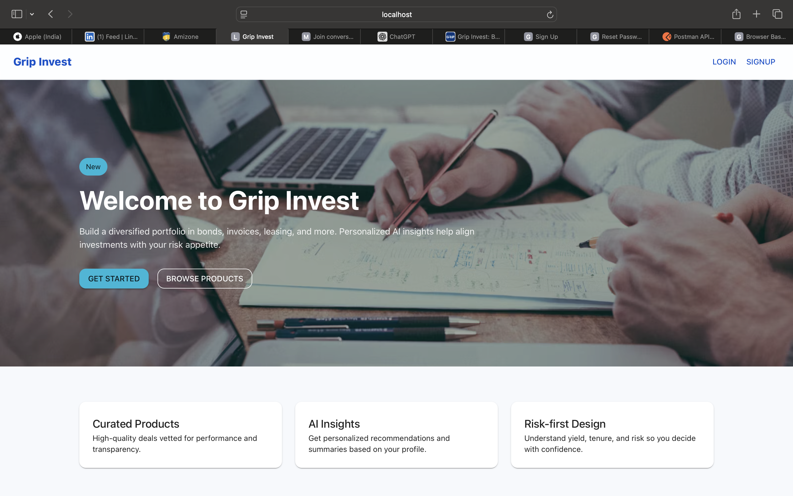

# Grip Invest - Mini Investment Platform (Winter Internship 2025)

A full-stack reference implementation of a mini investment platform.

- Backend: Node.js (Express) + MySQL
- Frontend: React (Vite) + Material UI + Recharts
- DevOps: Docker + docker-compose, health checks, logs to stdout
- Testing: Jest (+ Supertest for backend, React Testing Library for frontend)

---

## Contents
- Quick Start (Docker)
- Local Development
- Environment Variables
- Project Structure
- Database Schema & Seed
- API Overview
- Business Rules
- AI Features
- Testing & Coverage
- Logging & Monitoring
- Postman Collection
- Credentials
- Admin Panel (UI)

---

## Quick Start (Docker)

1) Create an `.env` in the project root (or copy `.env.example`):

```
# Backend
JWT_SECRET=supersecretjwt
BCRYPT_ROUNDS=10
PORT=4000
NODE_ENV=development
AI_MODE=local
# Optional Cohere (only if you want cloud AI)
# COHERE_API_KEY=your_key
# COHERE_MODEL=command
EMAIL_FROM=no-reply@gripinvest.local

# DB
MYSQL_HOST=db
MYSQL_PORT=3306
MYSQL_USER=grip
MYSQL_PASSWORD=grip_pass
MYSQL_DATABASE=grip_invest

# Frontend
VITE_API_BASE=http://localhost:4000
```

2) Start services:
```
docker compose up --build
```

3) Open:
- API Health: http://localhost:4000/health
- Frontend: http://localhost:5173

4) Seed DB (auto on first run). To re-seed:
```
docker compose exec backend node ./src/utils/seed.js --reset
```

---

## Local Development (without Docker)

Backend
```
cd backend
cp .env.example .env
npm install
npm run dev
```

Frontend
```
cd frontend
cp .env.example .env
npm install
npm run dev
```

MySQL: Ensure creds match your `.env`.

---

## Environment Variables

Backend
- JWT_SECRET: JWT signing secret
- BCRYPT_ROUNDS: bcrypt salt rounds
- PORT: Backend port (default 4000)
- NODE_ENV: development/test/production
- AI_MODE: local | cohere (default local)
- COHERE_API_KEY (optional): enable Cohere-backed AI features when AI_MODE=cohere
- COHERE_MODEL (optional): Cohere model id (default "command")
- EMAIL_FROM: From-address for reset emails (dev stub)
- MySQL: MYSQL_HOST, MYSQL_PORT, MYSQL_USER, MYSQL_PASSWORD, MYSQL_DATABASE

Frontend
- VITE_API_BASE: Backend base URL (default http://localhost:4000)

---

## Project Structure
```
backend/
  src/
    config/        # db, env, logger
    controllers/   # route handlers
    middleware/    # auth, error, logger
    models/        # SQL queries
    routes/        # Express routers
    services/      # business logic
    tests/         # Jest tests
    utils/         # AI helpers, seed
  Dockerfile
  package.json
frontend/
  src/
    pages/         # routed pages
    components/    # UI components
    api/           # API client
    context/       # auth provider
    hooks/         # hooks
    tests/         # Jest tests
  Dockerfile
  package.json

db/
  schema.sql
  seed.sql

postman/
  GripInvest.postman_collection.json

docker-compose.yml
```

---

## Database Schema & Seed
Tables
- users: id, email, password_hash, first_name, last_name, risk_appetite(low/moderate/high), role(user/admin), otp fields, full_name, phone, profile_photo_url, timestamps
- investment_products: canonical columns (investment_type, risk_level, annual_yield, min/max_investment, tenure_months) and legacy columns (type, risk, expected_annual_yield) for compatibility
- investments: id, user_id, product_id, amount, invested_at, status(active/matured/cancelled), expected_return, maturity_date, timestamps
- transaction_logs: user_id/email, endpoint, http_method, status_code, error_message (+ legacy method/status/error)
- wallets: user_id, balance

Seed data
- Two users (admin and demo user) with funded wallets
- Four products with a mix of risk/yield/tenure

---

## API Overview
Auth
- POST /api/auth/signup
- POST /api/auth/login
- POST /api/auth/request-reset
- POST /api/auth/reset

Users
- GET /api/users/me (auth)
- PUT /api/users/me (auth)
- POST /api/users/me/photo (auth, multipart file upload)

Products
- GET /api/products
- GET /api/products/:id
- POST /api/products (admin)
- PUT /api/products/:id (admin)
- DELETE /api/products/:id (admin)
- GET /api/products/:id/explainer (auth) – AI product explainer
- GET /api/products/recommendations (auth) – AI recommendations

Investments
- POST /api/investments (auth)
- GET /api/investments/me (auth) – portfolio + AI insights

Logs (admin/ops)
- GET /api/logs/me (auth) – your API transactions only
- GET /api/logs/search?q=<userIdOrEmail> (admin)

Health
- GET /health – reports service and DB status

Auth: Bearer JWT required for all except signup/login/reset/health. Admin-only routes require role=admin.

---

## Business Rules
- Invest amount must be numeric and within product min/max
- Wallet balance must be sufficient; purchase debits wallet
- Expected return ≈ amount * (annual_yield/100) * (tenure_months/12)
- Maturity date auto-computed from tenure
- Product filtering supports risk levels low/moderate/high and yield min/max

---

## AI Features
Default: AI_MODE=local (no external calls). Deterministic helpers power:
- Password strength hints (privacy-safe)
- Product description generation
- Product recommendations (risk-aware)
- Portfolio insights summary
- Error summaries for admin logs

Optional: AI_MODE=cohere with COHERE_API_KEY enables Cohere-backed enhancements. All AI calls have safe fallbacks to local logic.

---

## Testing & Coverage
Backend
```
cd backend
npm test -- --coverage --watchAll=false
```
- ESM-compatible Jest setup
- Target coverage ≥ 75% across modules

Frontend
```
cd frontend
npm test -- --coverage --watchAll=false
```

---

## Logging & Monitoring
- Backend prints useful operational logs to stdout/stderr (view with `docker logs`)
- Transaction logs are persisted to `transaction_logs` table (for ops/admin use)
- Frontend does NOT display backend server logs
- Health endpoint: GET /health (checks DB availability)

Common Docker log commands
```
# Tail backend logs
docker compose logs -f backend

# Tail frontend logs
docker compose logs -f frontend

# Tail MySQL logs
docker compose logs -f db
```

---


---

## Credentials (Dev)
- Admin: admin@grip.test / Admin@1234
- User: user@grip.test / User@1234

---

## Admin Panel (UI)
- Access: Log in with the admin account and click “Admin” in the top navbar, or open http://localhost:5173/admin while authenticated.
- Features:
  - Products CRUD: create, edit, delete products (fields map to backend canonical/legacy columns automatically).
  - Logs: list latest API transactions and search by user id/email; AI summarizes errors.
- Role-based UI:
  - Admin navbar shows: Admin, Profile, Logout. User-facing pages (Dashboard/Products/Investments) are hidden for admins to focus on ops.
  - Non-admin users cannot access /admin; they are redirected.

Ease of usage
- Clear navigation and protected routes based on JWT role.
- Seeded credentials (above) and prepopulated products/wallets for quick demo.
- All endpoints documented; UI covers primary flows.

---

## Security Notes
- JWT auth middleware, role checks for admin routes
- Rate limiting (express-rate-limit), Helmet, CORS
- Sanitized error handling; avoid exposing stack traces and secrets
- Profile photo upload via multipart form-data (not URL-based)

## Screenshots

### Home Page


### Dashboard


### Products Page


### Investment Page


### Admin Dashboard
